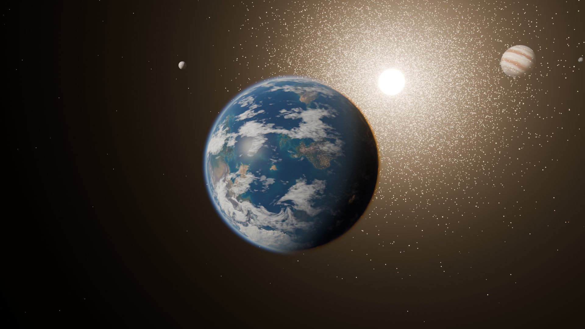
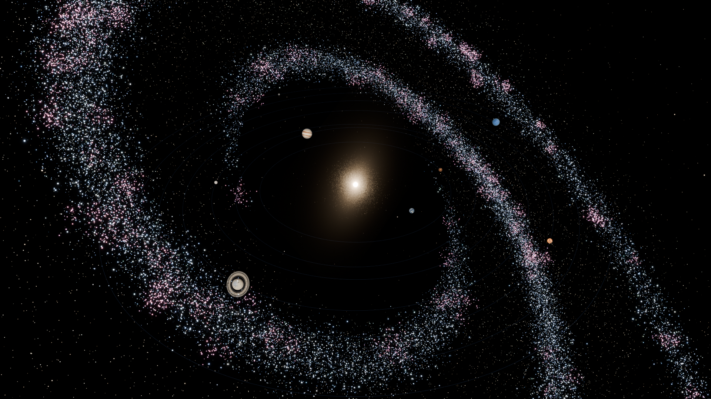
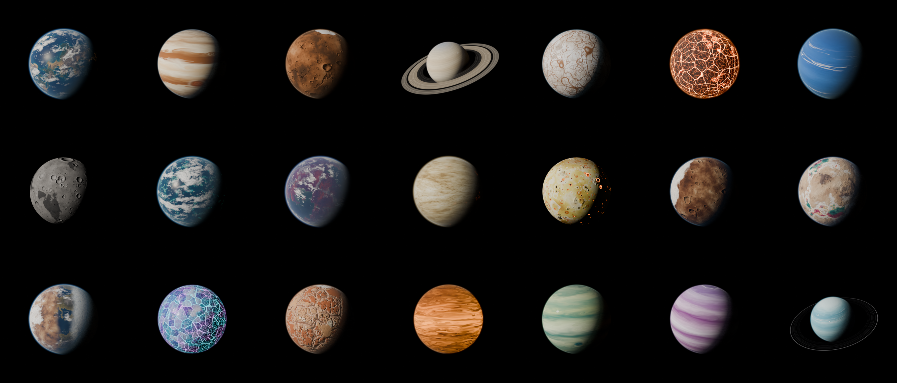

# Course Galaxy

Every course is a planet. The planets orbit a star, and the course you are on always sits centred
and "up front" while the rest of the system keeps moving in the background. You fly between planets
or warp to other galaxies. Finishing every lesson of a course "saves" its planet.

The planets are made in **Blender**: procedural materials rendered in Cycles, lit by a sun on a
black background. They are baked to textures that the **web page** (three.js) renders in real time
with matching lighting, clouds, atmospheres and rings. The page's HUD, navigation and star-system
layout come from the BlenderPlanet prototype (a Starfield-style menu layout).

| Blender: hero shot | Blender: the course system inside the galaxy |
|---|---|
|  |  |



## Run the galaxy page

```bash
python3 serve.py
```

Then open http://localhost:5173. Any static file server works; `serve.py` just turns off caching
(`python3 serve.py 8080` or `PORT=8080 python3 serve.py` picks another port).
three.js 0.186.1 loads from jsDelivr through the import map in `web/index.html`, and the Red Hat
fonts come from Google Fonts. There is no build step.

**Controls**

The HUD follows Starfield's menu layout: planet list on the left, the focused planet's card on the
right, the galaxy switcher top-centre and a key-prompt bar bottom-right. Every prompt is also clickable.

| Action | How |
|---|---|
| Fly to a planet | Click it in the list or in the scene |
| Next / previous planet | `←` `→` or `A` `D` |
| Orbit / zoom the focused planet | Drag; scroll or pinch to zoom. The camera only moves when you drag or scroll. |
| Back to the previous planet | `B` |
| Launch the course | `Enter` |
| New / edit / remove planet | `N` / `R` / `X`. Pick a Blender planet type, size, colour shift and whether it has an asteroid belt. |
| Switch galaxy | `Q` / `E` or the bumpers beside the galaxy name (warp transition). Click the name to list galaxies or create one. |

Switching planets flies a cinematic arc: the camera sweeps around the star, lifts over the orbital
plane mid-flight with a short FOV punch, and the key light swings over to the new planet's framing.

Data is saved in `localStorage` (key `course-galaxy/v2`). Delete that key to get the demo galaxies back.

## Wiring it into the course platform

The page dispatches cancelable events on `window`. Call `preventDefault()` to take over from the
built-in behaviour.

| Event | When | Default if not prevented |
| --- | --- | --- |
| `coursegalaxy:launch` | Launch pressed | demo dialog with a "complete a lesson" button |
| `coursegalaxy:back` | Back pressed | fly to the previously focused planet |
| `coursegalaxy:focus` | a planet became the focus | none |
| `coursegalaxy:saved` | a planet reached 100% | none (a shockwave plays) |
| `coursegalaxy:galaxy` | a galaxy finished loading | none |

`event.detail` is `{ planet, galaxy }`.

```js
window.addEventListener('coursegalaxy:launch', (e) => {
  e.preventDefault();
  openCourse(e.detail.planet.id);
});

// after the learner finishes a lesson:
CourseGalaxy.setProgress(planetId, lessonsCompleted);
```

The full API is on `window.CourseGalaxy`: `getState`, `focus`, `switchGalaxy`, `addGalaxy`,
`addPlanet`, `updatePlanet`, `removePlanet`, `setProgress` and `reset`. A planet is
`{ id, name, course, type, hue, size, lessons, completed, belt }`, where `type` is a planet type from
`web/assets/planets.json` and `belt` (optional) turns the ring of asteroids on or off. State persists to `localStorage` in `web/src/data.js`; swap that for your
backend when you wire it up.

### Web code map (`web/src`)

| File | What it does |
|---|---|
| `main.js` | Renderer, bloom, app state, picking, floating labels, galaxy warp, public API |
| `camera.js` | Focus rig: drag/zoom navigation, the fly-between-planets arc, and the key light |
| `system.js` | A star system: the star, orbits and layout, the main asteroid belt, occlusion fades, spawn flashes |
| `asteroids.js` | Asteroid belts of individual tumbling rocks (one instanced draw call per belt) |
| `planet.js` | One planet: surface, cloud layer, atmosphere and ring meshes built from the baked maps |
| `shaders.js` | GLSL: surface (normal map, ocean glint, city lights, cloud and ring shadows), ray-marched Rayleigh/Mie atmosphere, rings |
| `assets.js` | Planet-type manifest, the stars, star material (limb darkening), glow sprite |
| `background.js` | Milky-Way sky dome with nebulae, plus a matching starfield |
| `data.js` | Galaxies → planets data model, persistence, change events |
| `ui.js` | Planet list, detail card, galaxy switcher, prompt bar, modals, keyboard, toasts |

**How a planet is lit.** Every world is lit from where its star actually is, in the star's own
colour (white for a G star like the Sun, orange for a red dwarf, blue-white for a blue giant). So
each planet shows its true phase, and background worlds show theirs. The resting camera sits at a
~70 degree phase angle (star, planet, camera): most of the disc is in daylight with a long
terminator, and the star is off to the side. Drag round toward the star and the planet becomes a
crescent, with its atmosphere glowing around the limb. Other details:

- **Terminator:** sunlight grazing the terminator is reddened by its long path through the air.
- **Night side:** it gets only a faint starlight fill, so city lights and lava show.
- **Star:** limb-darkened with the linear law measured on SDO images (u ≈ 0.65), and bright enough
  to burn out to white at the centre, as it does in space photos.
- **Rings and belts:** ringed and belted worlds turn their axial tilt toward the resting view, so
  the rings or belt are seen open rather than edge-on. The planet's shadow falls across both.

**Asteroid belts.** Giant planets (Jovian, Azure) carry a belt of rocks by default, like
BlenderPlanet's gas giants; any non-ringed planet can have one. Each system also has a main belt
in its own gap between the inner and outer planets. The rocks are lumpy, low-poly "potatoes" in
charcoal C-type and brownish S-type colours. They orbit at Kepler speeds (inner rocks overtake
outer ones), tumble, and are shaded flat from the star.

References used for the lighting and belts:
[phase angle (Planetary Society)](https://www.planetary.org/articles/2179),
[Cassini crescent Tethys](https://science.nasa.gov/resource/tethys-crescent/),
[crescent Rhea](https://www.jpl.nasa.gov/images/pia14647-crescent-rhea/),
[Saturn's unlit rings at high phase](https://www.jpl.nasa.gov/images/pia09875-high-phase-rings/),
[Earth's limb from the ISS](https://earthobservatory.nasa.gov/images/150240/earths-limb-with-a-crescent-moon),
[sunset from the ISS](https://earthobservatory.nasa.gov/images/44267/sunset-from-the-international-space-station),
[solar limb darkening from SDO](https://ui.adsabs.harvard.edu/abs/2017JASS...34...99M/abstract),
[C-type asteroids](https://nineplanets.org/c-type-asteroids/).

## Blender pipeline (`blender/`)

`galaxy.blend` contains three scenes:

- **Galaxy**: a demo spiral galaxy built by seeded generators (ported from an earlier version of the
  web page, which showed the planets inside a spiral galaxy). It has the spiral disc as a Cycles point cloud, the core glow, the 8 course planets on their
  orbits, and two cameras: `GalaxyCam` (hero shot) and `SystemCam` (overview).
- **Planet Lab**: the planet library, one collection per type (`PT_terra`, `PT_jovian`, …). Each has a
  surface, a cloud shell, a volumetric atmosphere and rings, plus the portrait camera and sun.
- **Bake**: a scratch scene for texture baking.

Everything is generated by `blender/planetgen`, so the whole file can be rebuilt:

```bash
BL=/Applications/Blender.app/Contents/MacOS/Blender
$BL -b --factory-startup -P blender/cli.py -- portrait terra,dune --samples 48 --res 700   # quick look renders
$BL -b --factory-startup -P blender/cli.py -- bake all                # web textures + assets/planets.json
$BL -b --factory-startup -P blender/cli.py -- thumbs all --samples 96 # picker thumbnails + renders/<type>.png
$BL -b --factory-startup -P blender/cli.py -- scene all --samples 160 --res 1920  # galaxy.blend + hero/system renders
```

| Module | Role |
|---|---|
| `recipes.py` | Procedural shader recipes: Terra (continents, biomes, ice, city lights, cyclone clouds), Dune (Mars-like: craters, canyons, volcanoes), Glacier (Europa-like lineae), Inferno (lava cracks), Luna (craters with ray systems) |
| `gasgiant.py` | Gas and ice giants: band colours advected through jets, storms and curl noise (numpy flow simulation), including the red storm, white ovals and festoons |
| `build.py` | Planet specs (atmosphere, clouds, rings, web parameters), materials, lab scene, baking, normal-map generation, manifest |
| `galaxy_scene.py` | The Galaxy scene (seeded spiral galaxy and orbit generators) |
| `nodes.py` | Tiny helper for building node graphs from Python |

**Baked outputs** (`web/assets/planets/<type>/`): `color` (2K, plus a 4K version streamed in for the
hero), `normal` (east/north/up tangent space from the baked height), `spec` (water), `emissive`
(night lights, lava), `clouds`, `rings`, and `thumb` (the Cycles portrait). The equirect mapping
matches three.js `SphereGeometry`, so the web planets line up exactly with the Blender ones.

### Adding a new planet type

1. Write a recipe in `recipes.py` (or a preset in `gasgiant.py`) and register it in `RECIPES`.
2. Add a `SPECS` entry and append the id to `ORDER` in `build.py`. The entry covers atmosphere,
   clouds, rings and the `web` shading block.
3. Run `bake <id>` and `thumbs <id>`. The manifest updates and the type appears in the "New planet" picker.
4. Give it a base size in `TYPE_RADIUS` (`web/src/planet.js` and `galaxy_scene.py`).

A new star is one entry in `STARS` in `web/src/assets.js` (plus its albedo in `web/assets/stars/`); a new sky tint is one entry in `NEBULAE` in `web/src/data.js`.
